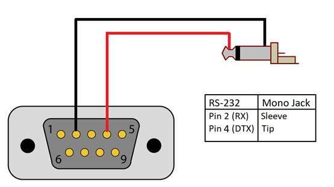

# REED SD-4023 Sound Meter RS232 Communication Module

This is a python2.7 module for the SD-4023 sound level meter/datalogger. The user manual
this module was written for can be found at:
[http://www.reedinstruments.com/pdfs/cache/www.reedinstruments.com/sd-4023/manual/sd-4023-manual.pdf](http://www.reedinstruments.com/pdfs/cache/www.reedinstruments.com/sd-4023/manual/sd-4023-manual.pdf)

This module is intended for use on Linux distributions, and has only been tested on Debian based distros using python 2.7.

## Getting Started

The REED SD-4023 Sound Level Meter is a device that measures sound levels nearby in decibel units. The SD-4023 communicates data via two methods: sd card and RS232 serial. The SD-4023 writes a .xls file to the sd card. This python module focuses on the RS232 serial communication and how to receive data from the unit.

## Prerequisites

### Materials

* 3.5mm TRS Stereo Jack
* DB9 Female Breakout Board
* RS232 to USB Adapter

### Hardware

On page 14 of the user manual, the PC Serial Interface shows an invalid wiring pinout. In order to properly interface with the SD-4023 using RS232 serial communication, the following connections must be made:
* 3.5mm TRS jack tip/top (left) goes to pin 4 DTR on the DB9 breakout
* 3.5mm TRS jack sleeve (ground) goes to pin 2 RX on the DB9 breakout



### Software

Clone this repository using SSH(or download the .zip file)

```
git clone git@github.com:HarshavardhanAnne/REED-SD-4023.git
```

Install the python2.7 serial library

```
sudo apt-get install python-serial
```

Navigate to the cloned directory and copy sd_4023.py to the project directory you are working in

```
cp sd_4023.py /path/of/project/
```

## How to Use

To use this module, the following inputs are required when creating an instance of this class:
* PORT: Linux serial port the unit is connected to, usually '/dev/ttyUSB0'
* PRINT_OPTION (optional): Enables or disables debug print statements (0 = Disabled, 1 = Enabled)

## Example

```
from sd_4023 import SD_4023  
sdObject1 = SD_4023('/dev/ttyUSB0')  
\#sdObject2 = SD_4023('/dev/ttyUSB0',1)  

\#Start serial connection to device  
sdObject1.open()  

\#Read entire 16 digit data stream, returned as a list  
data_stream = sdObject1.read()  
print data_stream  

\#Read only the decibel level, returned as a float  
decibels = sdObject1.read_decibel()  
print decibels  

\#Get the status of the serial connection  
sta = sdObject1.get_status()  
print sta  

\#Close serial connection to device  
sdObject1.close()  
```
